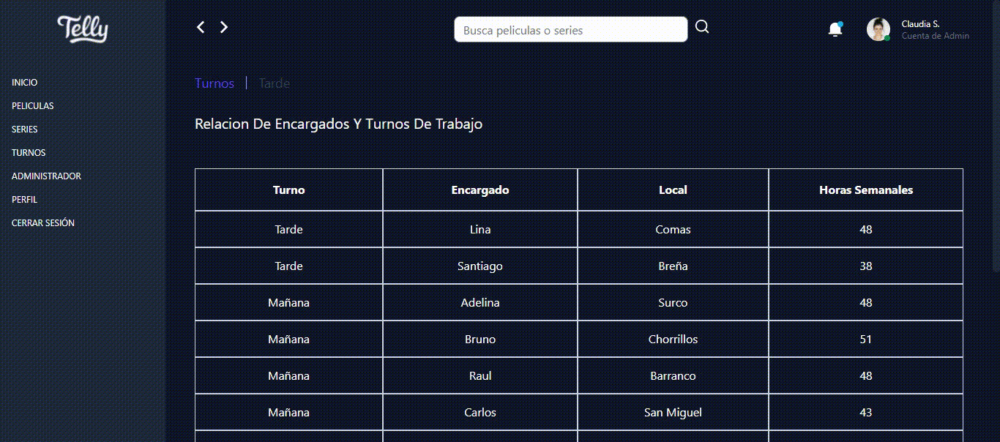

# Challenge Fluyez


.png)
.png)
.gif)


- [Código](https://github.com/Alemapyapur/Challenge-Fluyez)


## Funcionalidad


- [X] Se puede buscar peliculas.
- [X] Se puede buscar series.
- [X] Se puede agregar una nueva pelicula.
- [X] Se puede eliminar una pelicula
- [ ] se puede editar la pelicula agregada
- [X] Si el modal esta vacio no se agrega a la tabla.
- [ ] Tiene campos obligarios el modal.

## Stack Tech:
- React
- Axios
- Redux Tolkit
- React Router Dom
- React Table
- Tailwind


## Project Setup

```sh
npm install
```

### Compile and Hot-Reload for Development

```sh
npm run start
```
